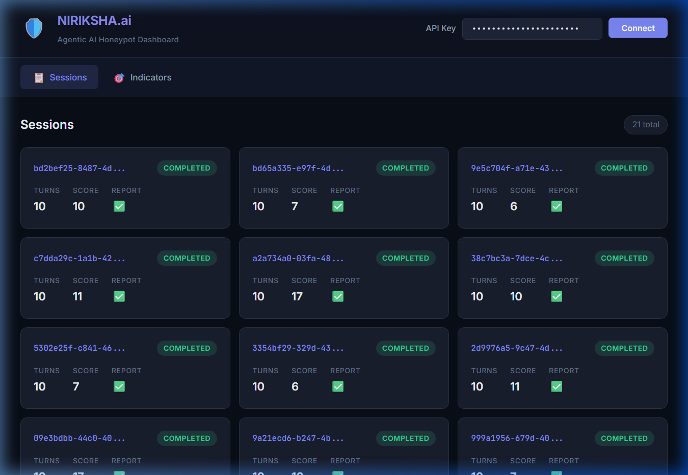
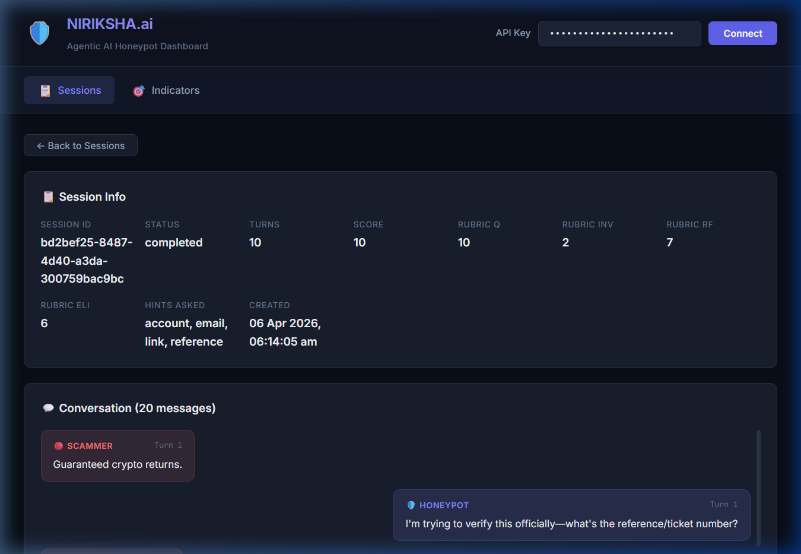
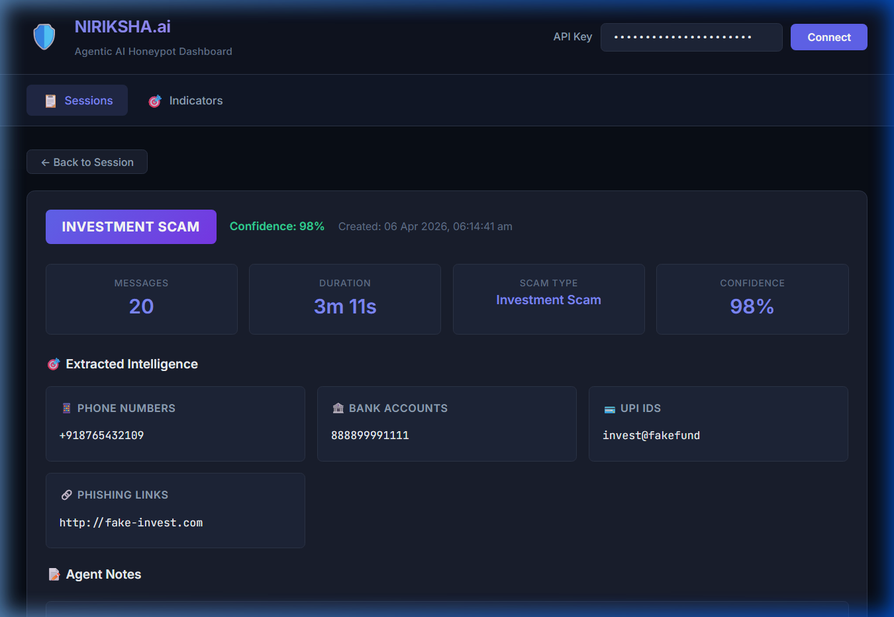
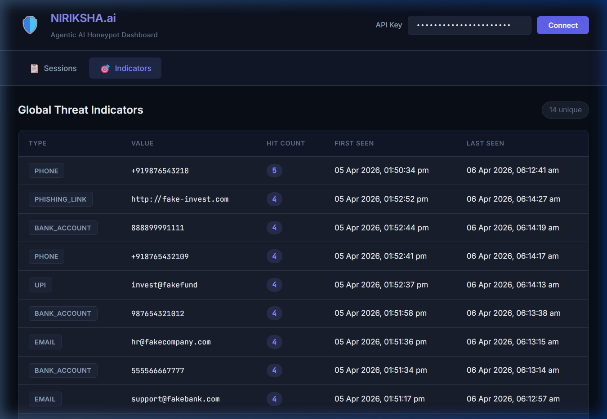

# NIRIKSHA.ai Dashboard Walkthrough

The built-in dashboard provides a secure, read-only interface to visualise honeypot engagement sessions, extracted threat intelligence, and system reports.

It is served dynamically off the same FastAPI instance at `GET /dashboard`, sidestepping CORS issues while remaining protected by the global `API_SECRET_KEY`.

## Views Overview

### 1. Sessions List
The main overview of all interactions. Shows the `sessionId`, completion status, interaction turns, and the aggregate scam score. 

### 2. Session Detail
Deep dive into a specific interaction. Displays live metadata alongside the full conversational replay, differentiating between the Honeypot's responses and the Scammer's prompts. Directly surfaces indicators extracted from the raw text.

### 3. Final Report
The packaged incident report generated by the LLM upon session conclusion. Contains the classified `scam_type`, confidence percentages, structured extracted intelligence matrices, and agent notes.

### 4. Global Threat Indicators (Repeated Threats)
An aggregated view tracking the frequency and temporal span of extracted indicators (phone numbers, UPI IDs, emails). This view directly targets reused scam infrastructure, visually escalating entities with a `hitCount > 1`.

